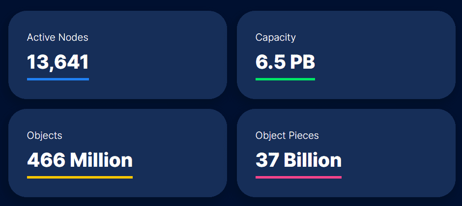
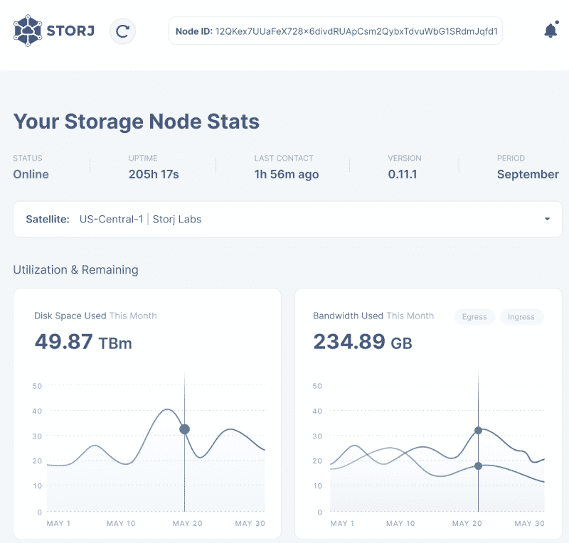

> Use your existing hardware and allocate a portion of your storage and bandwidth for Storj DCS (Decentralized Cloud Storage). By operating a Node you’ll be a part of making data more private and secure, giving ownership of data back to the people.

Running Storj is a very simple task that can earn you that beer money. If you're running any system at home 24/7 (NAS, Media, CCTV etc.), chances are you can run Storj on it with some free disk space.

If you're wondering about the legality of storing other users file do not worry. Files get split and encrypted before they hit your node. You will never have complete files stored and even then it's encrypted and will look like garbage.

As for requirements, they're pretty small. I started on a Raspberry Pi 3B from 2016, an SBC (single-board computer) with 1GB RAM and a 1.2GHz ARM Cortex-A53 processor. Not fast by any means, hell even the USB ports were only 2.0 but it started my journey with Storj. After hooking up a 2TB HDD to the device I was sharing my unused disk space.

|Node Requirements||Average Payout Per Month|Earnings|
|:---|---|---:|---:|
|550GB minimum disk space||Egress Bandwidth|$20/TB|
|2TB of monthly bandwidth||Repair Egress Bandwidth|$10/TB|
|5Mbps upstream bandwidth||Disk Space|$1.50/TB|
|25Mbps downstream bandwidth||Audit Bandwidth|$10/TB|

The benefit of a Raspberry Pi device is power usage, becoming more important with the rising cost of power. If you run another system already then adding Storj is not going to add too much more to your costs and will help pay for your homelab in time.

The usage stats are looking healthy too. 13k+ active nodes worldwide, providing 6.5PB and storing over 466 million objects split over 37 billion times between the nodes. Storj has seen year on year growth as its service matures.



### To get us started we will need:
1. A computer device

This can be an SBC like a Raspberry Pi, an old x86 desktop PC used for media, storage etc or even a QNAP or Synology NAS can run Storj.

2. Unused disk space

The minimum is 550GB but the more the better. You don't need to provision the storage straight away. Storj will only use what you store at the time. For the first few months don't expect more than 10-30GB a day.

When I used my Raspberry Pi my storage was from an external HDD through USB2.0 and that was acceptable. It gave me less content to store versus a more powerful device but it worked nonetheless.

3. Linux

Yes you can use Windows but you want things running Linux when it comes to storing and serving content. I wont gate keep, if you're more comfortable with Windows use that, they have working executables that will do the same job as on Linux. Know that uptime is important and Linux does it better here IMO.


Storj makes this whole setup pretty easy on their website. You need to create an authentication token to identify yourself, generate a node identity for your system, add a folder with how much you want to store in that folder, configure port forwarding, and finally start the node. Once setup you only need to start and stop the node for updates.

These steps are [here](https://www.storj.io/host-a-node). You must signup to get an authentication token, after that you can download their identity tool. This tool will need several hours of compute time to give you a unique identity on the Storj network.

```bash
curl -L https://github.com/storj/storj/releases/latest/download/identity_linux_amd64.zip -o identity_linux_amd64.zip
unzip -o identity_linux_amd64.zip
chmod +x identity
sudo mv identity /usr/local/bin/identity
```
I run it under screen so I can tab out and do other stuff without risk of losing my results.
```bash
screen -dmS StorjIdentity bash -c "identity create storagenode"
```
The tool needs to create a security key with a difficulty of 36 in order to be signed, depending on your devices performance this might be an hour, or 10. But once done you do not need to do it again.

After that you can link your key to your email address you used before to signup:

```bash
identity authorize storagenode yourdummy@email.com
```

Your keys will be stored in ```~/.local/share/storj/identity/storagenode/``` and you will want to check you have 2 ca certificates and 3 identity certificates. If not you will have to repeat the creation phase again. Back up these files to a safe location because if you lose them you will need to start over again.

Storj uses Docker on Linux so the next process is a one-time run to set up Storj:

```bash
docker run --rm -e SETUP="true" \
    --user $(id -u):$(id -g) \
    --mount type=bind,source="<identity-dir>",destination=/app/identity \
    --mount type=bind,source="<storage-dir>",destination=/app/config \
    --name storagenode storjlabs/storagenode:latest
```

Change ```<identity-dir>``` and ```<storage-dir>``` with your chosen location. I keep everything under a folder on the mounted disk I'm using for Storj. E.g

```/mnt/storj/identity/storagenode``` for ```<identity-dir>```

```/mnt/storj/storagenode``` for ```<storage-dir>```

This is a one-time run command to set up your system.

After that you can run the node:

```bash
docker run -d --restart unless-stopped --stop-timeout 300 \
    -p 28967:28967/tcp \
    -p 28967:28967/udp \
    -p 127.0.0.1:14002:14002 \
    -e WALLET="0xXXXXXXXXXXXXXXXXXXXXXXXXXXXXXXXXXXXXXXXX" \
    -e EMAIL="user@example.com" \
    -e ADDRESS="domain.ddns.net:28967" \
    -e STORAGE="2TB" \
    --user $(id -u):$(id -g) \
    --mount type=bind,source="<identity-dir>",destination=/app/identity \
    --mount type=bind,source="<storage-dir>",destination=/app/config \
    --name storagenode storjlabs/storagenode:latest
```

Change ```WALLET```, ```EMAIL```, ```ADDRESS```, ```STORAGE```, ```<identity-dir>```, and ```<storage-dir>```.

Your ```WALLET``` is your ERC20 based address to accept Storj tokens. ERC20 are native tokens to the Ethereum blockchain network, they do not operate their own blockchain but rather piggyback off Ethereum. Regardless you should have one, [MyEtherWallet](https://www.myetherwallet.com/) is a popular online wallet to get started.

```EMAIL``` is what you used to signup to Storj.

```ADDRESS``` is going to be your connectable node address, be it an IP or Dynamic DNS you will need to be connectable to the outside world. If you do not have a static IP you will need to use dynamic DNS to update your address every time your IP changes.

```STORAGE``` is how much storage you will provide. This can be changed anytime, it will slowly use storage as you leave it running. Start with 1TB and move up as you feel.

```<identity-dir>``` and ```<storage-dir>``` remain the same as before.

If everything is setup correct you will have a working web dashboard you can access on port 14002. As long as you see a Status of Online you are officially running an active node on Storj!



I want to finish this post off by saying you will not get rich overnight. Or at all... It is not recommended to go out and buy new equipment for this either, the ROI is not there. IF (and this is a big if) you have the hardware already and want to offer some compute and storage towards Storj then go for it.